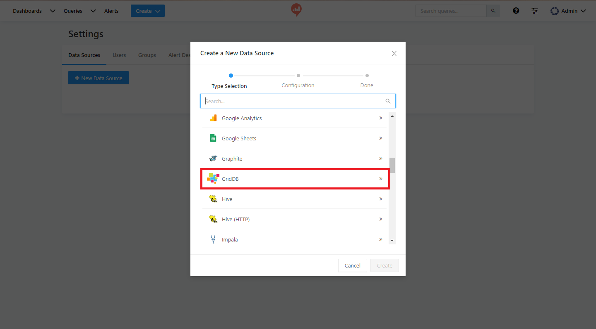
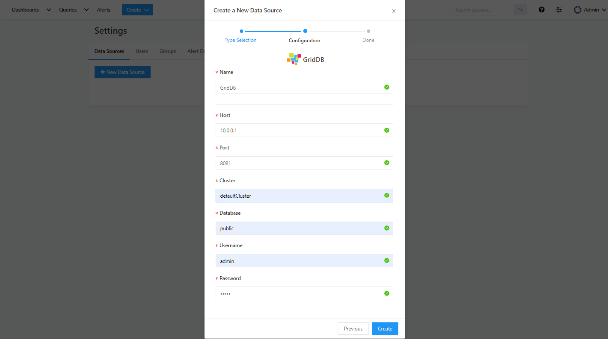
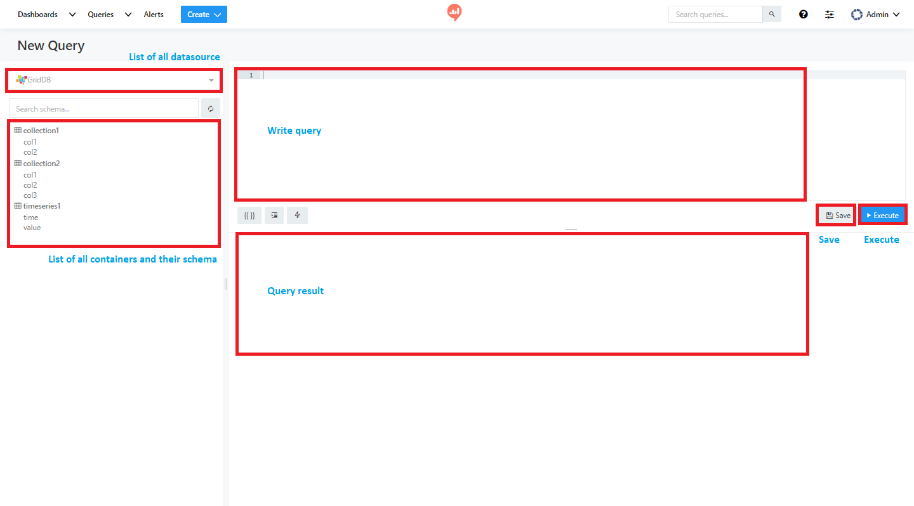
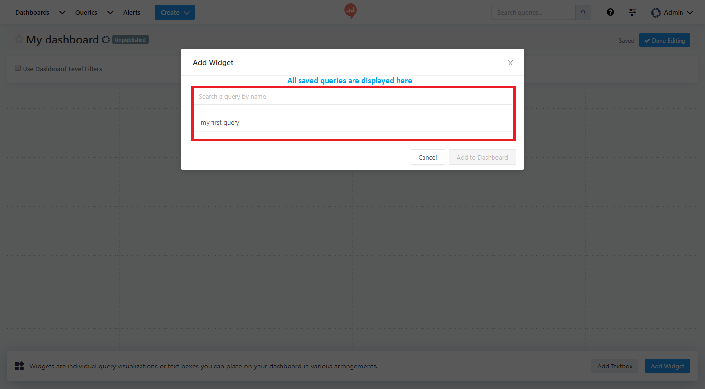
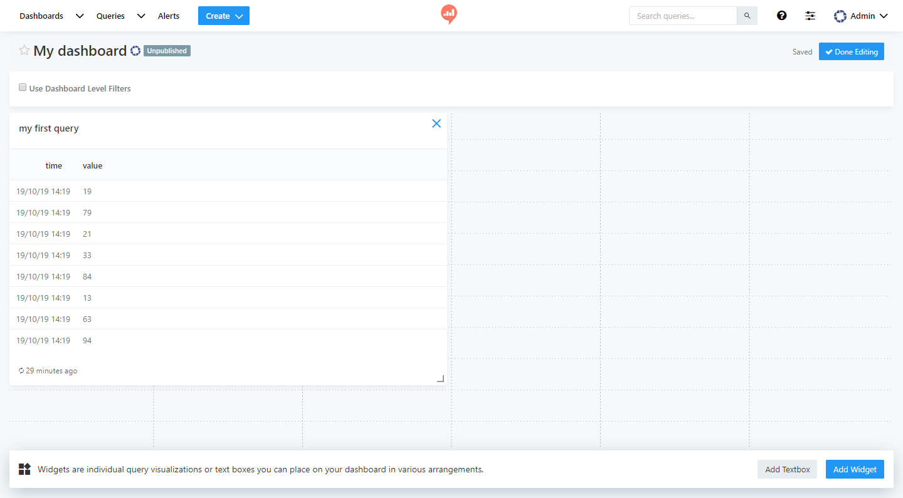

# Install GridDB Plugin for Redash

## Setting up a Redash Instances

Go to [Homepage](https://redash.io/help/open-source/setup/) of Redash.

## Install GridDB Plugin

1\. Put file griddb.png into $REDASH_SETUP_FOLDER/client/app/assets/images/db-logos

2\. Put file griddb.py into $REDASH_SETUP_FOLDER/redash/query_runner

3\. Modify file $REDASH_SETUP_FOLDER/redash/settings/\_\_init\_\_.py as below:

```py
default_query_runners = [
  'redash.query_runner.athena',
  'redash.query_runner.big_query',
  ........
  'redash.query_runner.uptycs',
  'redash.query_runner.griddb'      --> Add this line
]
```

To apply new datasource plugin, go to $REDASH_SETUP_FOLDER:

```sh
npm run build
docker-compose build worker
docker-compose build server
docker-compose up
```

# Create dashboard with GridDB

## Set up a new datasource (GridDB)



<span class="anchor" text-align="center"></span>Figure 1: Add datasource

From list of datasource, choose **GridDB**



<span class="anchor" text-align="center"></span>Figure 2: Add datasource

Field | Description
--- | --- |
Name | Name of GridDB datasource
Host | IP address of WebAPI
Port | Port of WebAPI
Cluster | Cluster name
Database | Database name. Input only "public"
Username | User name of GridDB
Password | Password of GridDB

- Click **Save** to save datasource
- Click **Test connection** to test the connection to datasource

## Create query for GridDB

From main menu, click **Create**/**Query** to create a new query



<span class="anchor" text-align="center"></span>Figure 3: Create query

- GridDB Plugin supports **TQL** as queries
- GridDB Plugin supports **auto-complete** for queries
- Once a query is saved, it should be **published** to visualize in dashboard

## Create dashboard

From main menu, click **Create**/**Dashboard** to create a new dashboard

Click **Add widget** to add a **Visualization** with data obtained from a **Query** for **Dashboard**



<span class="anchor" text-align="center"></span>Figure 4: Add widget for dashboard

Click **Add to dashboard**, data will be displayed (with many types of visualizations)



<span class="anchor" text-align="center"></span>Figure 5: Add widget for dashboard
